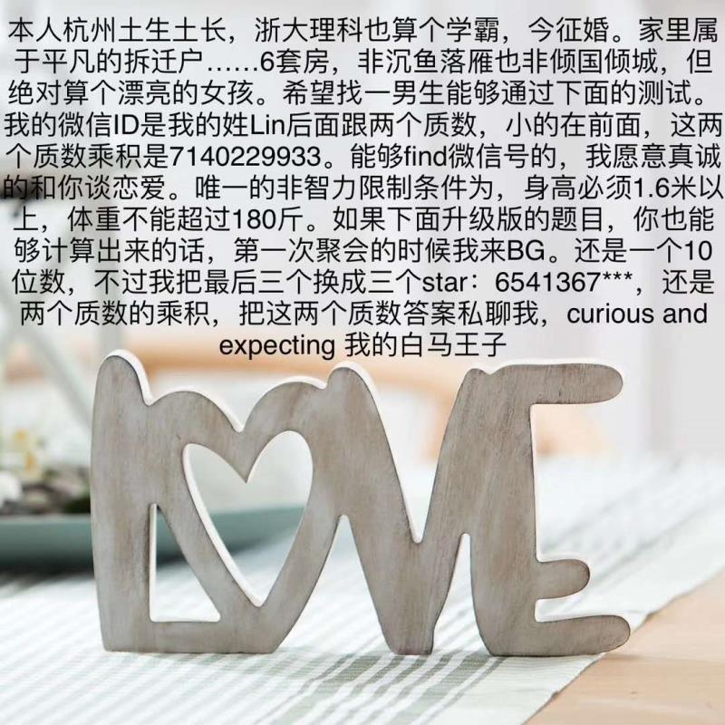

## 学霸征友

## golang 实现
> 一个数是两个质数的积，求这两个质数
1. CalcPrime1 函数，7140229933 是两个质数的积，求两个质数
    
        83777 85229

2. CalcPrime2 函数，6541367*** 是两个质数的积，求两个质数和 6541367***

        最终计算出有 151 个:
        6541367003 = 23 * 284407261
        6541367005 = 5 * 1308273401
        6541367011 = 37 * 176793703
        6541367017 = 41 * 159545537
        6541367023 = 5419 * 1207117
        6541367037 = 3 * 2180455679
        6541367038 = 2 * 3270683519
        6541367039 = 14177 * 461407
        6541367043 = 3 * 2180455681
        6541367053 = 13 * 503182081
        6541367059 = 20359 * 321301
        6541367061 = 3 * 2180455687
        6541367071 = 31 * 211011841
        6541367077 = 7 * 934481011
        6541367113 = 53 * 123422021
        6541367114 = 2 * 3270683557
        6541367117 = 17 * 384786301
        6541367127 = 3 * 2180455709
        6541367135 = 5 * 1308273427
        6541367137 = 73 * 89607769
        6541367141 = 23 * 284407267
        6541367153 = 11839 * 552527
        6541367159 = 37 * 176793707
        6541367167 = 4231 * 1546057
        6541367169 = 3 * 2180455723
        6541367171 = 2089 * 3131339
        6541367173 = 11 * 594669743
        6541367177 = 19 * 344282483
        6541367179 = 24439 * 267661
        6541367186 = 2 * 3270683593
        6541367189 = 7 * 934481027
        6541367201 = 2857 * 2289593
        6541367207 = 40819 * 160253
        6541367218 = 2 * 3270683609
        6541367239 = 11 * 594669749
        6541367241 = 3 * 2180455747
        6541367254 = 2 * 3270683627
        6541367257 = 31 * 211011847
        6541367258 = 2 * 3270683629
        6541367267 = 409 * 15993563
        6541367277 = 3 * 2180455759
        6541367289 = 3 * 2180455763
        6541367293 = 32707 * 199999
        6541367297 = 263 * 24872119
        6541367309 = 331 * 19762439
        6541367311 = 883 * 7408117
        6541367317 = 55901 * 117017
        6541367323 = 241 * 27142603
        6541367341 = 5107 * 1280863
        6541367353 = 52901 * 123653
        6541367359 = 137 * 47747207
        6541367369 = 97 * 67436777
        6541367374 = 2 * 3270683687
        6541367379 = 3 * 2180455793
        6541367402 = 2 * 3270683701
        6541367413 = 7 * 934481059
        6541367419 = 269 * 24317351
        6541367421 = 3 * 2180455807
        6541367429 = 73 * 89607773
        6541367431 = 53 * 123422027
        6541367433 = 3 * 2180455811
        6541367438 = 2 * 3270683719
        6541367439 = 3 * 2180455813
        6541367446 = 2 * 3270683723
        6541367447 = 6203 * 1054549
        6541367451 = 3 * 2180455817
        6541367459 = 11 * 594669769
        6541367461 = 947 * 6907463
        6541367471 = 5839 * 1120289
        6541367473 = 1013 * 6457421
        6541367477 = 157 * 41664761
        6541367479 = 89 * 73498511
        6541367483 = 7 * 934481069
        6541367485 = 5 * 1308273497
        6541367489 = 67049 * 97561
        6541367491 = 17 * 384786323
        6541367497 = 7 * 934481071
        6541367501 = 19081 * 342821
        6541367503 = 11 * 594669773
        6541367521 = 13 * 503182117
        6541367523 = 3 * 2180455841
        6541367531 = 83 * 78811657
        6541367541 = 3 * 2180455847
        6541367545 = 5 * 1308273509
        6541367551 = 47 * 139178033
        6541367554 = 2 * 3270683777
        6541367557 = 19 * 344282503
        6541367563 = 97 * 67436779
        6541367577 = 3 * 2180455859
        6541367597 = 431 * 15177187
        6541367599 = 13 * 503182123
        6541367603 = 37 * 176793719
        6541367605 = 5 * 1308273521
        6541367609 = 7 * 934481087
        6541367611 = 11497 * 568963
        6541367617 = 113 * 57888209
        6541367619 = 3 * 2180455873
        6541367626 = 2 * 3270683813
        6541367627 = 17 * 384786331
        6541367649 = 3 * 2180455883
        6541367654 = 2 * 3270683827
        6541367662 = 2 * 3270683831
        6541367663 = 58049 * 112687
        6541367669 = 71 * 92131939
        6541367674 = 2 * 3270683837
        6541367681 = 443 * 14766067
        6541367689 = 1693 * 3863773
        6541367707 = 7 * 934481101
        6541367719 = 9421 * 694339
        6541367727 = 3 * 2180455909
        6541367731 = 9887 * 661613
        6541367738 = 2 * 3270683869
        6541367743 = 971 * 6736733
        6541367747 = 19 * 344282513
        6541367758 = 2 * 3270683879
        6541367761 = 10709 * 610829
        6541367765 = 5 * 1308273553
        6541367771 = 79801 * 81971
        6541367773 = 211 * 31001743
        6541367782 = 2 * 3270683891
        6541367793 = 3 * 2180455931
        6541367795 = 5 * 1308273559
        6541367806 = 2 * 3270683903
        6541367829 = 3 * 2180455943
        6541367843 = 113 * 57888211
        6541367845 = 5 * 1308273569
        6541367851 = 1567 * 4174453
        6541367857 = 19309 * 338773
        6541367871 = 3 * 2180455957
        6541367873 = 541 * 12091253
        6541367879 = 61 * 107235539
        6541367883 = 3 * 2180455961
        6541367887 = 8681 * 753527
        6541367901 = 3 * 2180455967
        6541367906 = 2 * 3270683953
        6541367909 = 49109 * 133201
        6541367915 = 5 * 1308273583
        6541367921 = 11 * 594669811
        6541367923 = 23 * 284407301
        6541367926 = 2 * 3270683963
        6541367927 = 47 * 139178041
        6541367929 = 487 * 13431967
        6541367933 = 17 * 384786349
        6541367942 = 2 * 3270683971
        6541367951 = 97 * 67436783
        6541367959 = 7 * 934481137
        6541367962 = 2 * 3270683981
        6541367963 = 13 * 503182151
        6541367971 = 331 * 19762441
        6541367989 = 13 * 503182153
        6541367995 = 5 * 1308273599